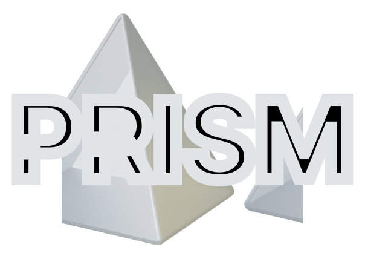

<br/><br/>
<p align="center">
  
<h3 align="center"><b>Capturing Polysemanticity with PRISM: A Multi-Concept Feature Description Framework</b></h3>
<p align="center">
  PyTorch

  </p>

This repository contains the code and experiments for the paper **[Capturing Polysemanticity with PRISM: A Multi-Concept Feature Description Framework](https://arxiv.org/abs/2506.15538)** by Kopf et al., 2025. 

## Table of Contents

- [About](#-about)
- [Repository Overview](#-repository-overview)
- [Installation](#-installation)
- [Running Experiments](#-running-experiments)
  - [1 Feature Descriptions](#feature-descriptions)
  - [2 Evaluation](#evaluation)
  - [3 Meta-labels](#metalabels)

## About

</p>
<p align="center">
  
</p>

Unlike prior approaches that assign a single description per feature, PRISM (Polysemantic FeatuRe Identification and Scoring Method) provides more nuanced descriptions for both polysemantic and monosemantic features. PRISM samples sentences from the top percentile activation distribution, clusters them in embedding space, and uses an LLM to generate labels for each concept cluster. We benchmark PRISM across various layers and architectures, showing how polysemanticity and interpretability shift through the model. In exploring the concept space, we use PRISM to characterize more complex components, finding and interpreting patterns that specific attention heads or groups of neurons respond to. Our findings show that the PRISM framework not only provides multiple human interpretable descriptions for neurons but also aligns with the human interpretation of polysemanticity.

## Repository Overview

The repository is organized for ease of use:
- **`assets/explanations/`** – Pre-computed feature descriptions from various feature description methods.  
- **`descriptions/`** – Feature descriptions generated with **PRISM**.  
- **`generated_text/`** – Concept text samples generated for evaluation purposes.  
- **`notebooks/`** – Contains a Jupyter notebook for reproducing the benchmark table and plots shown in the paper.  
- **`src/`** – Core source code, including all necessary functions for running feature description and evaluation.


## Installation

Install the necessary packages using the provided [requirements.txt](https://github.com/lkopf/prism/blob/main/src/requirements.txt):

```bash
pip install -r requirements.txt
```

## Running Experiments

First, set paramters in [src/utils/config.py](https://github.com/lkopf/prism/blob/main/src/utils/config.py) or use default parameters.

### 1. Feature Descriptions

This script outputs multiple feature descriptions based on percentile sampling and clustering for one feature.

```bash
python src/concept_clustering.py
```

To generate descriptions for multiple features define `EXPLAIN_FILE` in [config.py](https://github.com/lkopf/prism/blob/main/src/utils/config.py) and run: 

```bash
python src/run_concept_clustering.py
```

Generated feature descriptions can be found in [descriptions](https://github.com/lkopf/prism/tree/main/descriptions) folder.

### 2. Evaluation

Evaluate feature descriptions with CoSy scores:

```bash
python src/evaluation.py
```

Generated concept samples can be found in [generated_text](https://github.com/lkopf/prism/tree/main/generated_text) folder.

Evaluate all feature descriptions per feature with polysemanticity score (cosine similarity), max AUC, and max MAD.

```bash
python src/meta_evaluation.py
```

All evaluation scores can be found in [results](https://github.com/lkopf/prism/tree/main/results) folder.

### 3. Meta-labels

To generate meta-labels for concepts found in feature descriptions run:

```bash
python src/run_concept_summary.py
```

All meta-label results can be found in **`metalabels/`** folder.


## Citation

If you find this work interesting or useful in your research, use the following Bibtex annotation to cite us:

```bibtex
@misc{kopf2025prism,
      title={Capturing Polysemanticity with PRISM: A Multi-Concept Feature Description Framework}, 
      author={Laura Kopf and Nils Feldhus and Kirill Bykov and Philine Lou Bommer and Anna Hedström and Marina M. -C. Höhne and Oliver Eberle},
      year={2025},
      eprint={2506.15538},
      archivePrefix={arXiv},
      primaryClass={cs.LG},
      url={https://arxiv.org/abs/2506.15538}, 
}
```
This work is in review.

### Thank you

We hope our repository is beneficial to your work and research. If you have any feedback, questions, or ideas, please feel free to raise an issue in this repository. Alternatively, you can reach out to us directly via email for more in-depth discussions or suggestions.

📧 Contact us:
- Laura Kopf: kopf[at]tu-berlin.de

Thank you for your interest and support!